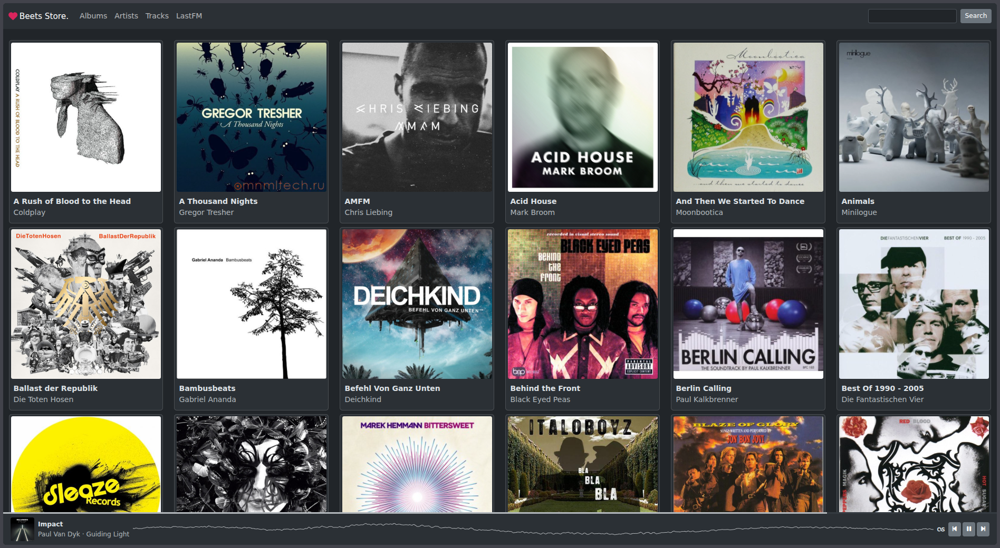
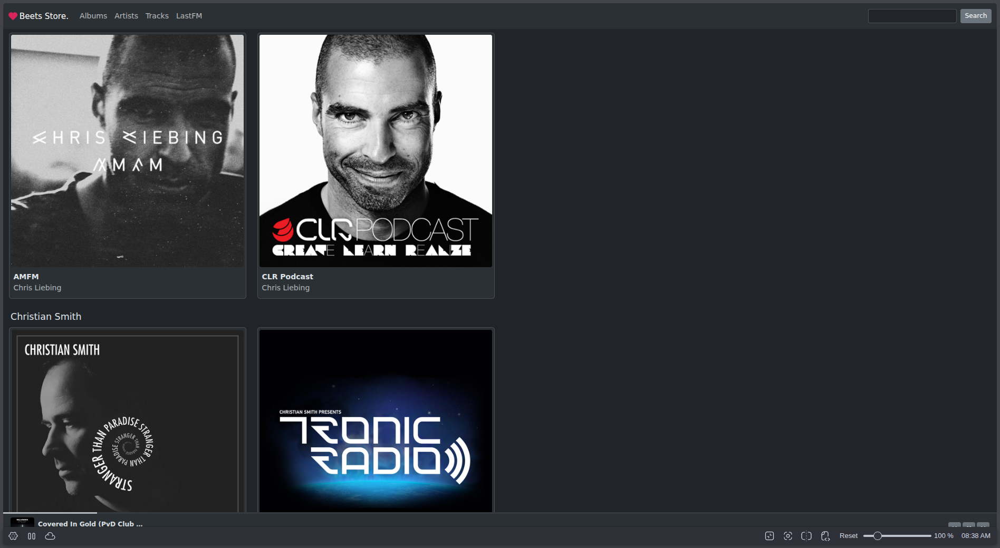
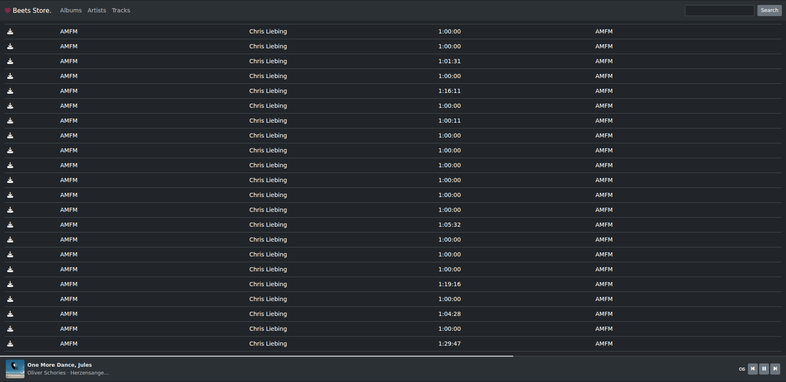
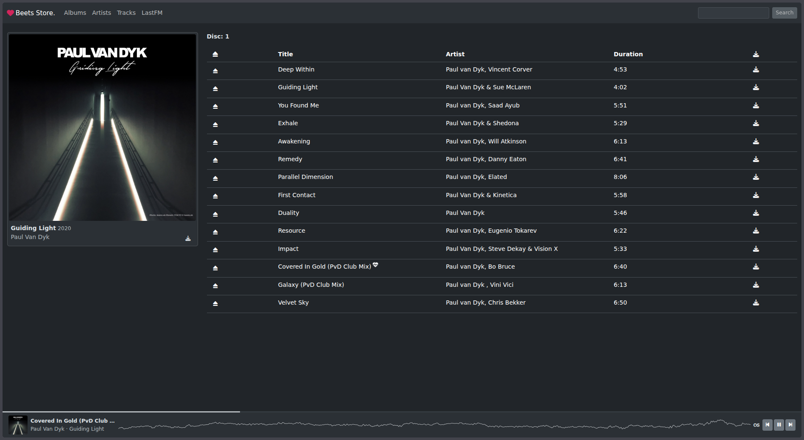

# Beets Store

A plugin for the music geek's media organizer.

## Introduction

*Beets Store* is a web frontend for your music library organized by
[beets](http://beets.radbox.org/).

* Play the music in your browser.
* Optional scrobble the played music info to [LastFM](https://www.last.fm)
* Download the music files and entire albums (A zipped directory with the music
  files and the album cover image.)

## Screenshots

### Albums overview



### Artists overview



### Tracks overview



### Album detailview



## Installation

Install required services.

    $ apt install redis

Install package and scripts.

    $ git clone https://github.com/tschaefer/beets-store
    $ cd beets-store
    $ pipx install --include-deps .

## Usage

Add plugin settings to beets configuration file.

```
store:
  host: "::1"
  port: 8080
  zipdir: /tmp/beets/store/zip
  cors_origins: "https://music.example.com"
  lastfm:
    api_key: API_KEY
    secret_key: SECRET_KEY
```

The `cors_origins` setting is optional by default all `*` requests are
allowed.

The `lastfm` settings are optional. If you don't want to scrobble leave the
settings out.

Example beets [configuration file](https://gist.github.com/tschaefer/daa09959eb7272715800#gistcomment-1684418)

Import audio files.

    $ beet import /music

Fetch cover art.

The album art image must be stored as `cover.jpg` alongside the music files
for an album. For optimal display all the images should have an equal width and
height of at least 300x300 px.

    $ beet fetchart

Start job queue worker.

The job queue is used to create album zip files for the download.

    $ rq worker

Start the web service.

    $ beet store

### Docker

Configure environment file.

Set `BEETS_MUSIC_VOLUME` in the environment file `docker-compose.env`.

For overriding the configuration file and persist the database enable and set
the proper settings in the enviroment and compose files.

The container runs as a non-root user `beets` with UID/GID `1000`. Ensure the
host music directory is readable (and writable, for album art fetching) by
UID `1000`.

Start the service.

    $ docker compose --env-file docker-compose.env up

## Development

### Prerequisites

* Python >= 3.11
* Redis (see [Installation](#installation))

### Set up the virtual environment

Clone the repository and create a virtual environment inside the project
directory.

    $ git clone https://github.com/tschaefer/beets-store
    $ cd beets-store
    $ python3 -m venv venv
    $ source venv/bin/activate

Install the package in editable mode so that code changes take effect
immediately without reinstalling.

    $ pip install -e .

### Configure a local beets library

Create a minimal beets configuration file, e.g. `venv/store.yml`, pointing
to your music directory and a local SQLite database.

```yaml
directory: /path/to/your/music
library: venv/store.db
import:
  write: false
  copy: false
  move: false
  resume: false
  autotag: false
plugins: store fetchart
fetchart:
  auto: false
store:
  host: "127.0.0.1"
  port: 8080
  zipdir: /path/to/your/music/zip
```

Import your music and fetch cover art.

    $ beet --config venv/store.yml import /path/to/your/music
    $ beet --config venv/store.yml fetchart

### Run the development server

Start the Redis-backed job queue worker in one terminal.

    $ source venv/bin/activate
    $ rq worker

Start the Flask development server in a second terminal.

    $ source venv/bin/activate
    $ FLASK_DEBUG=true beet --config venv/store.yml store

The store is now available at `http://127.0.0.1:8080`.

A `Procfile` can be used with a process manager such as
[Foreman](https://github.com/ddollar/foreman) to start both processes at once.

```
queue: rq worker
store: beet --config venv/store.yml store
```

## License

[BSD 3-Clause “New” or “Revised” License](https://choosealicense.com/licenses/bsd-3-clause/)

### Further thirdparty license

 * [beetsplug/store/static/img/404.jpg](https://pngimg.com/image/101094)

## Is it any good?

[Yes](https://news.ycombinator.com/item?id=3067434)
